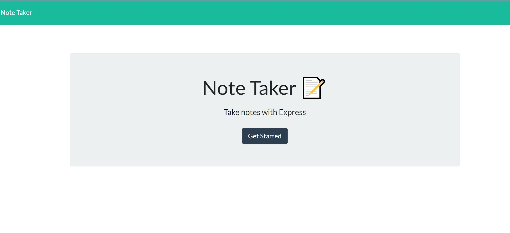
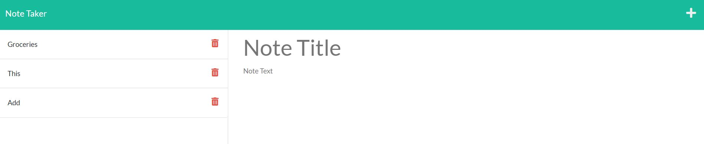

# Note Taker

  

  ## Description
  This app provides you with Note saving capabilities! If you want to jot something down for a reminder , this Note Taker App provides the basic essentials of saving and deleting Notes.

  ## Table of Contents
  * [Installation](#installation)
  * [Usage](#usage)
  * [Screenshots](#screenshots)
  * [License](#license)
  
  ## Installation
  To install, download as zip. You should have express.js installed to run the application properly.

  ## Usage
  If you want to take a note, you can click the plus sign to save a new note. Note Title will appear as well as a text underneath. In order for the Note to be saved, you must include something in the text in order for the save button to show. 

  ## Screenshots
  
  This is the Home Page of the Note Taking app.

  
  Once _Get Started_ is clicked from the __Home Page__, you will be directed to the page where you can see, add or even delete notes.

  

  ## Contributing
  For further contributions, please contact me via email.

  ## Tests
  Tests are written in the __tests__ folder and they are executed through Jest.

  ## Questions
  If you have any questions or concerns about this application, please contact me via email: __bradleyj1@email.arizona.edu__ You may also visit my Github page: __https://github.com/JazmyneB__